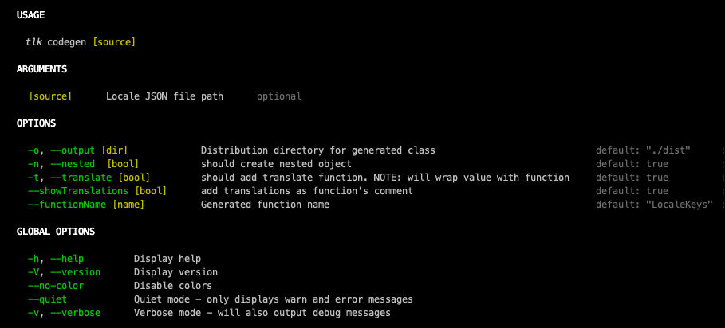

# Typed-Local-Keys

generate typescript code from locale keys JSON.


### Getting Started

```
tlk codegen [INPUT_JSON_FILE] --output [DESTINATION_DIRECTORY]
```

## How to use

#### <u>in `package.json`</u>
add to `scripts`
```javascript
"pretest": "tlk codegen [ENTRY-DIRECTORY]/messages_en.json [OUTPUT-DIRECTORY]",
```

#### <u>initialize generated file with translate function</u>
```javascript
const localeKeys = LocaleKeys(i18nConf.t.bind(i18nConf));
```

#### <u>in root component ONLY</u>
add `@translate`. it adds the `wait` logic that prevents rendering prior loading all keys
```typescript
import {translate} from 'react-i18next';

@translate
export class App extends React.Component<any> {
    // ... //
}
```

## Example

input: `messages_en.json`:

```javascript
{
  "home.header": "header",
  "home.header.title": "{{greeting}} {{person.firstName }} {{ person.lastName }} today is {{date, DD/MM/YYYY}}",
  "home.header.subtitle": "this is my hello world",
  "home-empty.body.header": "on this app you will do nothing",
  "home.body.description.#phone.$value": "this describes the meaningless apps"
}
```

output:
```typescript
/* tslint:disable */
export type IFullExample = ReturnType<typeof fullExample>;

export function fullExample(translate: Function) {
    return {
        home: {
            header: {
                $value: () => translate('home.header') /* header */,
                title: (options: { greeting: any, person: { firstName: any, lastName: any }, date: any }) => translate('home.header.title', options) /* {{greeting}} {{person.firstName }} {{ person.lastName }} today is {{date, DD/MM/YYYY}} */,
                subtitle: () => translate('home.header.subtitle') /* this is my hello world */
            },
            body: {
                description: {
                    '#phone': {
                        $value: () => translate('home.body.description.#phone.$value') /* this describes the meaningless apps */
                    }
                }
            }
        },
        'home-empty': {
            body: {
                header: () => translate('home-empty.body.header') /* on this app you will do nothing */
            }
        }
    };
}
/* tslint:enable */

```

configuration area `package.json`:
```javascript
"typedLocaleKeys": {
    "entries": {
      "GalleryKeys": {
        "source": "./locale/messages_en.json",
        "output": "./dist/gallery"
      },
      "CommonKeys": "./locale/sub/messages_en.json" // for source only
    },
    "primaryOutput": "./dist" // fallback output (after cli's `--output` fallback)
},
```

more options:



